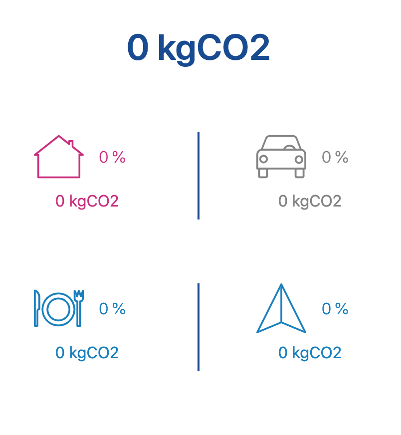
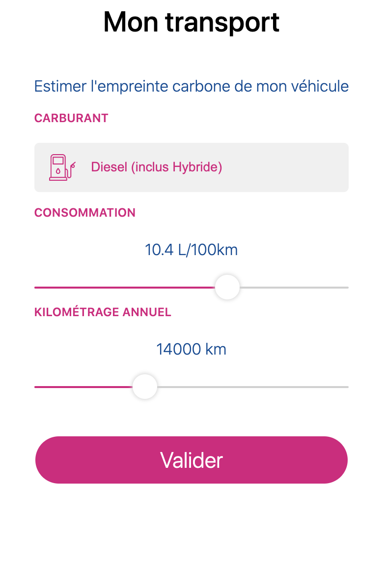
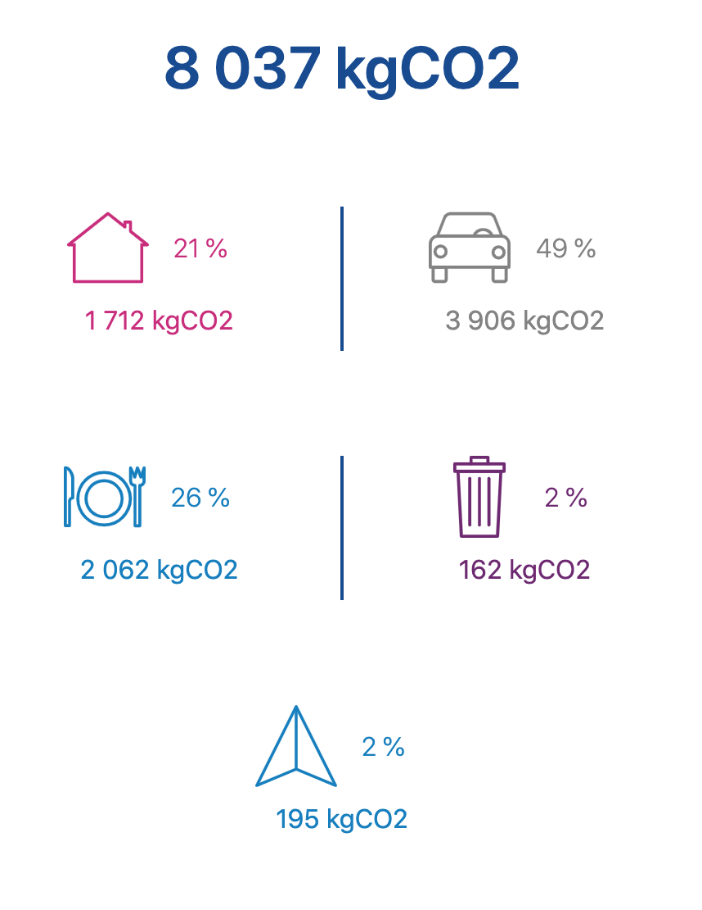

[](https://opensource.org/licenses/MIT)


[](https://travis-ci.org/CompteCO2/Carbon-Weight)


# Carbon-Weight
Carbon Footprint Calculator For Individuals And Households. This carbon footprint calculation allows you to estimate and calculate your personal or business carbon footprint whether it comes from **housing, travels, transportation or food habits** (made by https://www.compteco2.com/). It has been designed to be integrated for a final user ease of use.

You may directly use this calculator online from https://myco2emission.com/ (Data Update In Progress).

|  |  |  | 
:-------------------------:|:-------------------------:|:-------------------------:|:-------------------------:

You may also install the self contained npm package to use it from your own projects:
```
npm i @cco2/carbon-weight
```

# Build
**Prerequisites**
```
Git
Node.js >= 12 (tip: use nvm or n to manage multiple Node versions)
```

**Build**
```
nvm use # Check supported version
npm i
npm run build
```

- Run the linter.
- Build the source code.
- Run the unit tests - display coverages.

**Release**
```
npm run build:release
```
- Run the linter.
- Build the source code.
- Run the unit tests - display coverages.
- Upload coverages.
- Generate the documentation as interactive HTML pages (typedoc).

# Methodology & Data
Here are the methodologies and data used for our CO2 emission calculator. Please keep in mind that all emission computed are given in **kgCO2e/year**. The data sourced below come from the French Government and UE Official agencies. Fell free to add you own data and contribute with them to enhance internationalization capacity.

## Flight Emissions
First, the distances are calculated between the airports selected, using the greater circle method: we compute the **distance in Km** from longitude and latitude using the haversine formula (cf. https://en.wikipedia.org/wiki/Haversine_formula).

Then we can use the factor emission (cf. wiki below) to get our first estimation per equivalent person:
- Emission = Distance * Factor
- [kgCO2e/year] = [Km/year] * [kgCO2e/km]

Finally, we add a factor depending on the class of the seat taken (economy class, business class, first class). Connections are not taken into account.

Want more insight about the distance computation and factors in use ? Here is the wiki page dedicated:
### [Flight Emissions Factors](/wiki/flight.md)

## Food Emissions
The idea is to compute a quite rough co2 emission (kgCO2e/year) estimate from weekly eating habits. The weekly consumption based has been choosen for its convenience to be estimated by an individual.

The food carbon footprint is by design a best estimate, this approximation still allows to get an order of magnitude. The formula in use, is as simple as :
- emission = Sum[ (weaklyConsumed * averageWeight * 52) / 1000 * carbonEmissionFactor ]
- waste = SUM[ (weaklyConsumed * averageWeight * 52) / 1000 * wasteRatioFactor * wasteEmissionFactor ]

Here are the factor units in use:
- [kgCO2e/year] = (52[g/week]) / 1000 * [kgCO2e/kg]
- [kgCO2e/year] = (52[g/week]) / 1000 * [kgPackaging/kg] * [kgCO2e/kgPackaging]

Want more insight about the factors in use ? Here is the wiki page dedicated:
### [Food Emissions Factors](/wiki/food.md)

## House Emissions
We compute here the CO2e emission estimation from heating housing with this simple computation:
- Emission = Surface * ConsumptionFactor * CombustibleFactor * ClimateCoef
- [kgCO2e/year] = [m²] * [kWh/(m².year)] * [kgCO2e/kW] * Cste

We use the last version of the carbon base data (2021) from he French Agency for Ecological Transition (ADEME).

Want more insight about the classifications and factors in use ? Here is the wiki page dedicated:
### [House Emissions Factors](/wiki/house.md)

## Vehicle Emissions
The carbon footprint from car usage can be calculated using different methods, providing the result in differing levels of accuracy. We propose two computations :
- **From Fuel Consumption**: Type of Fuel and, Consumption or Annual Mileage and actual MPG.
- **From Registration Card**: Type of Fuel, Mileage and original emission factor or consumption factor.
- **From Car Type**: Annual Mileage and the gCO2/km figure (explained below).

Although the first computation method is the most precise, it relies on a parameter that could be quite uncertain (depends on personal measure) or even unknown. Indeed, the exact MPG (real consumption) for the period of the annual mileage could be difficult to get with precision if not measured properly.

This is the best choice if you cannot guarantee the actual MPG. This method is based on the constructor factor emission corrected by the vehicle age.

The last one is the least precise, but still allows you to get a fairly good CO2 emission estimation of your vehicle from only the car type and your annual mileage.

Want more insight about the different methods and factors in use ? Here is the wiki page dedicated:
### [Vehicle Emissions Factors](/wiki/vehicle.md)

# Contribute
Send me a mail at michael.jeulin-lagarrigue@compteco2.com for ways to get help or getting started contributing. Ideas for new plugins and tools are welcome and can be posted in issues with the "enhancement" label.

A curated list of awesome resources can be found within our wiki, do no hesitate to provide us other country data from trusted source (Government, Government operator, Public Agency, Recognized ONG).
