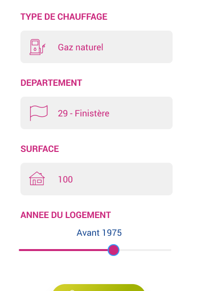
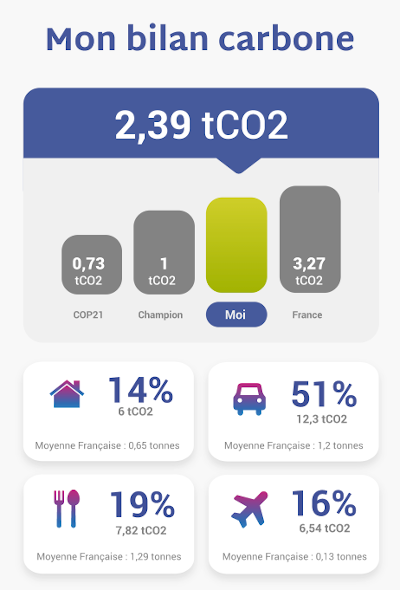

[](https://opensource.org/licenses/MIT)


[](https://travis-ci.org/CompteCO2/Carbon-Weight)


# Carbon-Weight

Carbon Footprint Calculator For Individuals And Households. This carbon footprint calculation allows you to estimate and calculate your personal or business carbon footprint whether it comes from **housing, travels, transportation or food habits** (made by https://www.compteco2.com/). It has been designed to be integrated for a final user ease of use.

You may directly use this calculator online from URL (todo).

|  |  |  |
| :--------------------: | :--------------------: | :--------------------: |


You may also install the self contained npm package to use it from your own projects:

```
npm i @cco2/carbon-weight
```

# Build

**Prerequisites**

```
Git
Node.js >= 12 (tip: use nvm or n to manage multiple Node versions)
```

**Build**

```
nvm use # Check supported version
npm i
npm run build
```

- Run the linter.
- Build the source code.
- Run the unit tests - display coverages.

**Release**

```
npm run build:release
```

- Run the linter.
- Build the source code.
- Run the unit tests - display coverages.
- Upload coverages.
- Generate the documentation as interactive HTML pages (typedoc).

# Methodology, Data & API

Please follow our [wiki](https://github.com/CompteCO2/Carbon-Weight/wiki) to get a full insight of our computation an data sources.

The API documentation is contained within this wiki.

You may also get pratical use cases within UTs.

# Contribute

Send me a mail at michael.jeulin-lagarrigue@compteco2.com for ways to get help or getting started contributing. Ideas for new plugins and tools are welcome and can be posted in issues with the "enhancement" label.

A curated list of awesome resources can be found within our wiki, do no hesitate to provide us other country data from trusted source (Government, Government operator, Public Agency, Recognized ONG).
